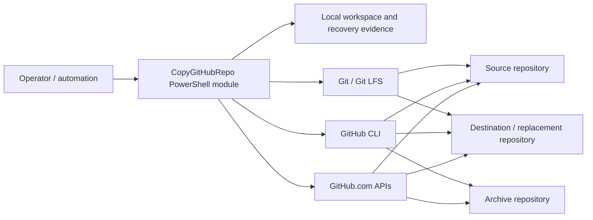
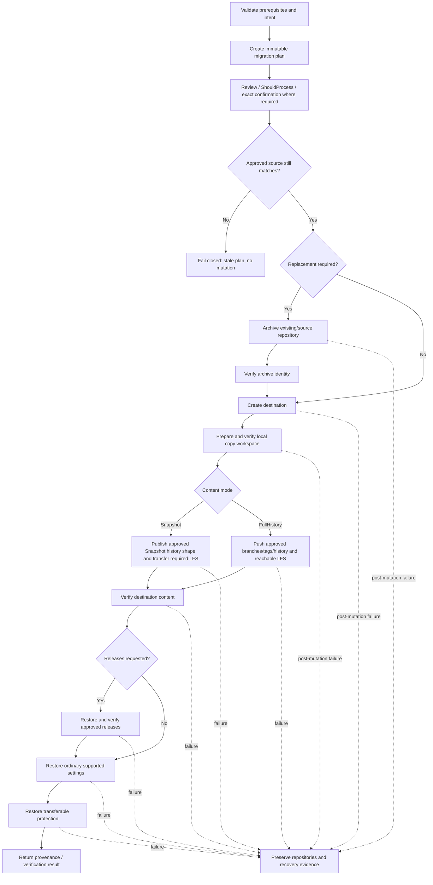
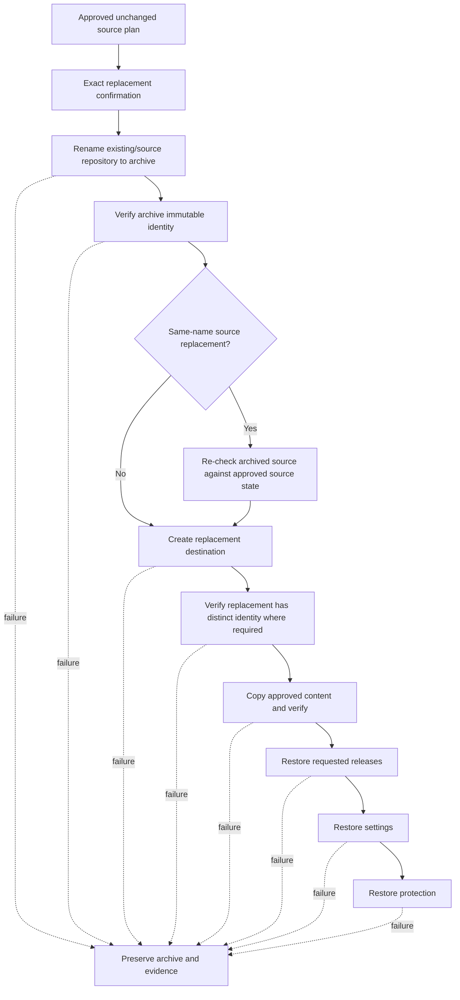

# Architecture

## Goals

Copy GitHub Repository is designed around safe orchestration, explicit authority, immutable reviewed source state, recoverability, and evidence-based verification. Presentation remains separate from copy semantics so console behavior cannot weaken the application safety model.

`Snapshot` is the default clean current-state publication mode. `FullHistory` is the explicit history-preserving copy mode.

Durable architectural rationale is recorded in [`docs/product/adr/`](adr/README.md). The product contract remains authoritative for behavioral requirements.

## System context and trust boundaries

Trust-boundary interpretation:

- The **operator boundary** supplies intent, confirmation, credentials already managed by GitHub CLI, and any report paths.
- The **module/application boundary** owns planning, safety checks, orchestration, verification, and evidence semantics.
- The **local process boundary** contains temporary Git workspaces and durable reports. Local disk/resource failure can interrupt execution but must not redefine remote success.
- The **native-tool boundary** contains Git, Git LFS, and `gh`. Native processes are invoked without shell evaluation through centralized infrastructure helpers.
- The **GitHub.com boundary** is externally mutable and permission/service dependent. Repository names are not treated as immutable identities; repository IDs/node IDs are used where available.
- v0.1.0 deliberately supports only `github.com`; other hosts fail closed.

## Layers

1. **Launcher** imports the module and starts the public wizard.
2. **Presentation** owns interactive prompts, contextual controls, progress, and concise result rendering.
3. **Application** owns planning, approved-plan execution, replacement orchestration, verification, settings/protection restoration, provenance, and recovery.
4. **Domain/evidence** models plans, immutable source state, completed steps, repository identity, verification evidence, and results.
5. **Infrastructure** invokes Git, GitHub CLI, and GitHub APIs.

`Start-CopyGitHubRepositoryWizard` is not a second copy engine. `Copy-GitHubRepository -PlanOnly` creates its real review artifact; after review the wizard passes that same plan to the private approved-plan application boundary.

## Logical-to-physical map

| Logical responsibility | Primary physical location | Notes |
| --- | --- | --- |
| Public application entry points | `src/CopyGitHubRepo/Public/` | Public commands and their PowerShell-facing contracts. |
| Planning, copy, verification, and result orchestration | `src/CopyGitHubRepo/Private/Migration/` | Approved-plan execution, Snapshot/FullHistory copy, verification, provenance, and migration reporting. |
| Replacement and archive safety | `src/CopyGitHubRepo/Private/Replacement/` | Existing-destination and same-name replacement, exact confirmation, identity checks, and replacement recovery reporting. |
| Repository state and protection | `src/CopyGitHubRepo/Private/Repository/` | Repository discovery/modeling, approved source state, preflight, protection, and host support. |
| Presentation/wizard helpers | `src/CopyGitHubRepo/Private/Wizard/` plus public wizard entry | Presentation delegates to shared application semantics. |
| Native Git boundary | `src/CopyGitHubRepo/Private/Git/` | Centralized native process invocation, Git identity, and Git LFS helpers. |
| GitHub API/CLI adapters | `src/CopyGitHubRepo/Private/GitHub/` | GitHub reads, mutations, authentication, repository creation/rename/settings, and existence checks. |
| Shared private utilities | `src/CopyGitHubRepo/Private/Utility/` | Small cross-capability helpers that do not own product workflow. |
| Module composition/exports | `src/CopyGitHubRepo/CopyGitHubRepo.psm1`, `CopyGitHubRepo.psd1` | Recursive deterministic private loading, public exports, and package metadata. |
| Automated executable conformance | `tests/unit/`, `tests/integration/`, `tests/contract/`, `tests/TestTaxonomy.psd1` | Deterministic Unit, Integration, and Contract classifications. |
| Authenticated live conformance | `tests/e2e/` | Disposable-GitHub E2E harnesses; capability is distinct from release-candidate evidence. |
| Build/quality/package tooling | `build/` | Stable repository-owned build entry points/configuration plus analyzer internals under `build/PSScriptAnalyzerRules/`. |
| CI/release/deployment boundaries | `.github/workflows/` | Cross-platform quality, documentation/site, and release automation. |
| Product/quality/architecture authorities | `docs/` | Product contract/model, quality strategy, architecture, NFRs, recovery, ADRs. |

For maintainer change-impact guidance, see [`maintainer-guide.md`](../engineering/maintainer-guide.md).

## Common execution flow

The Snapshot and FullHistory branches share planning, replacement, verification staging, requested-release restoration ordering, settings/protection ordering, provenance, and recovery semantics. Their content and tag-target invariants remain deliberately different.

## Planning boundary

`New-CgrMigrationPlan` validates source/destination/archive intent, captures supported source protection/configuration evidence, and captures `SourceState` before returning the plan.

Snapshot `SourceState` contains the approved repository identity when available, default branch, commit SHA, tree SHA, and Git LFS evidence. With `-IncludeReleases`, the plan additionally binds the exact approved release selection and immutable Snapshot release-checkpoint evidence derived from it.

FullHistory `SourceState` contains the approved repository identity when available, default branch, sorted branch/tag ref targets, reachable commit count, branch-tip trees, and Git LFS availability.

Planning performs no GitHub mutation.

## Snapshot release-checkpoint architecture boundary

The normative behavior of `Snapshot -IncludeReleases` is defined only in [`product-contract.md#snapshot-release-checkpoint-contract`](product-contract.md#snapshot-release-checkpoint-contract). Architecture does not duplicate its topology rules.

Architecturally, Snapshot release preservation is a distinct **checkpoint-history construction** path inside the Snapshot content boundary, not a FullHistory rewrite and not a conventional squash/rebase of the source graph. The path consumes reviewed release/tag evidence, normalizes supported annotated and lightweight tags to peeled commit targets, validates the product contract's deterministic ancestry ordering, and fails closed before mutation when the reviewed selected topology cannot be represented safely.

Plain Snapshot remains the one-unrelated-root path when `-IncludeReleases` is absent. FullHistory remains the history-preserving path. The implemented Snapshot release path reuses shared approved release-selection/restoration infrastructure where the contracts match while keeping checkpoint construction, recreated tag targets, verification/provenance, recovery evidence, and wizard integration mode-aware.

## Approved-plan execution boundary

`Invoke-CgrApprovedMigrationPlan` is the shared internal execution boundary for the public command and wizard. It requires `SourceState`, re-checks the source before the first mutation, preserves exact replacement-confirmation rules, and dispatches the already-reviewed plan into the appropriate orchestration path.

If repository identity or Git state no longer matches, `Assert-CgrApprovedSourceState` throws `SourceStateChangedSincePlanning`. New-destination execution therefore stops before destination creation. Existing-destination replacement stops before archiving the current destination. Same-name replacement stops before renaming the source.

The public command creates one plan, applies its validation/`ShouldProcess`/confirmation rules, and executes that same plan. It does not reconstruct a second plan after confirmation.

## Guided interaction boundary

The wizard uses native PowerShell interaction helpers. Valid contextual controls are displayed explicitly: `[? help]`, `[B back]`, `[C cancel]`, and `[F filter]` only for repository filtering. Enter accepts the displayed default. Hidden long-form navigation commands are not accepted.

The wizard displays **Repository copy plan** with mode-specific human language. Plain Snapshot is described as clean publication into one unrelated root commit. When Snapshot release preservation is selected, the wizard explains that selected release states become new checkpoint commits and that original source commit identities/ancestry are not preserved; its release filters are passed into the real planning path. FullHistory is described as history-preserving copy. Internal/debug objects are not rendered as user-facing protection status.

After the user selects Execute, the wizard's `ShouldProcess` guard runs and then the exact displayed plan is sent to the approved-plan boundary. If `SourceStateChangedSincePlanning` is returned before mutation, the wizard reports the stale plan and returns to plan generation/review. It does not silently approve the newly observed source state.

## Copy-workspace boundary

The pre-mutation source check closes the plan/review TOCTOU window, but source state is also checked inside the cloned workspace before destination publication:

- Snapshot verifies the cloned commit/tree and LFS evidence against the approved Snapshot state before creating/pushing the destination Snapshot history. With release preservation, the checkpoint path additionally consumes the reviewed release/tag/tree evidence already captured by the approved plan.
- FullHistory verifies the bare clone's ref targets, reachable commit count, branch-tip trees, and LFS evidence before pushing LFS objects, branches, or tags.

This prevents a moving source from being substituted between preflight and clone.

## Destination verification boundary

Execution verification does not reclone a potentially moved source and redefine success after publication.

Plain Snapshot destination verification compares the destination tree and one-root-commit history shape with the approved/copied Snapshot evidence. Snapshot release-checkpoint verification independently proves the expected generated checkpoint sequence/parentage, checkpoint tree/state equivalence, selected release tag targets, and final reviewed HEAD state from immutable reviewed checkpoint evidence. Release metadata/assets and Latest designation are verified separately against the same approved selection.

FullHistory destination verification compares the destination's branch/tag targets, reachable commit count, branch-tip trees, default branch, and LFS availability with the approved FullHistory evidence. FullHistory release verification retains original tag commit-identity semantics.

`Test-GitHubRepositoryMigration` remains a separate explicit read-only command. Snapshot release verification requires the approved plan so it cannot rerun live selection/topology discovery; FullHistory release verification retains its current-source comparison behavior.

## Replacement flow

Same-name replacement uses the archive's canonical identity/clone URL after rename rather than relying on an old-name redirect. Existing-destination archive-and-replace verifies the archived destination identity before creating the replacement. For Snapshot release preservation, selected archive release/tag evidence remains bound to the reviewed checkpoint plan while destination tags are recreated against new checkpoint commits; FullHistory retains original tag targets.

## Mutation and recovery state model

The canonical operator-facing mutation/recovery state model is maintained in [`troubleshooting-recovery.md`](../user/troubleshooting-recovery.md#mutation-and-recovery-state-model). Architecture deliberately reuses that model instead of maintaining a competing copy.

Architectural interpretation:

- Before first mutation, a rejected/stale operation must remain a no-op against GitHub.
- Archive/rename and destination creation are explicit mutation boundaries.
- Verification separates "published" from "verified." Requested release restoration, settings, or protection can therefore fail after content is already verified.
- A post-mutation failure transitions to preservation/recovery, not automatic rollback.

## Configuration restoration

Ordinary supported repository settings are restored only after content and requested release verification and are read back for verification. Transferable repository protection is restored last so protection cannot block initial content publication or requested release restoration.

Plans retain captured protection evidence; execution reuses that evidence rather than performing an unrelated late source rediscovery. Security semantics that cannot be transferred safely are reported as skipped/unsupported rather than weakened.

## Provenance and recovery

Structured execution results distinguish `ApprovedSourceState` from `ActualCopiedSourceState`/copied evidence. Plain Snapshot provenance records destination root commit/tree and repository identities. Snapshot release-preservation provenance additionally records reviewed/generated checkpoint and recreated tag/release evidence. Replacement results expose original/archive/replacement identity explicitly.

Recovery reports retain the failure stage, completed steps, known repository identities, and available planned-versus-copied evidence. Snapshot release recovery can retain created checkpoint/tag/release evidence without treating it as rollback state. Recovery does not automatically delete repositories, commits, tags, or releases or rename repositories back.

## Runtime and infrastructure

The compatibility baseline is PowerShell 7.4+ on Windows, macOS, and Linux. Git and GitHub CLI are prerequisites. HTTPS Git operations use GitHub CLI as a command-scoped credential helper without changing global Git configuration. FullHistory requires Git LFS; Snapshot requires it when any approved Snapshot state contains LFS-tracked content.

The current release line supports only `github.com`, case-insensitively, and fails closed for unsupported hosts.

## Architecture fitness functions

Architecture claims are protected through executable conformance rather than review prose alone.

| Architectural property | Primary executable evidence |
| --- | --- |
| Plan is bound to immutable approved source state and stale plans fail closed | `ApprovedSourceState.Tests.ps1`, `StaleStateSafety.Tests.ps1` |
| Snapshot retains clean one-root-commit semantics unless release checkpoints are explicitly requested | `NewDestinationSnapshot.Tests.ps1`, `SnapshotReleaseSafety.Tests.ps1`, `DocumentationContract.Tests.ps1`, Snapshot E2E harness |
| Snapshot release preservation constructs/verifies reviewed checkpoints and recreated releases without preserving source commit identity | Snapshot release planning/execution/verification integration suites and `Invoke-SnapshotReleaseEndToEndTests.ps1` |
| FullHistory preserves approved refs/history | `FullHistory.Tests.ps1`, FullHistory E2E harness |
| Existing/same-name replacement preserves identity and does not silently overwrite | `ExistingDestinationReplacement.Tests.ps1`, `SameNameSafety.Tests.ps1`, `SameNameExecution.Tests.ps1`, same-name E2E harnesses |
| Partial failure retains recovery evidence instead of auto-rollback | `Recovery.Tests.ps1`, `RiskFailurePaths.Tests.ps1`, recovery E2E harness |
| Settings follow content/requested-release verification and protection is restored last | `RepositorySettings.Tests.ps1`, `Protection.Tests.ps1`, `ProtectionRestoreStatus.Tests.ps1` |
| Wizard delegates to shared application semantics | `WizardMigrationIntegration.Tests.ps1`, `WizardOrchestration.Tests.ps1` |
| Native commands use controlled process invocation | `NativeCommandStreams.Tests.ps1` plus PSScriptAnalyzer/style contracts |
| Unsupported hosts fail closed | `HostName.Tests.ps1` |
| Human/machine documentation classification remains aligned | `tests/TestTaxonomy.psd1`, documentation Contract suites, `docs/engineering/quality-strategy.md` |

The detailed quality/evidence semantics are authoritative in [`quality-strategy.md`](../engineering/quality-strategy.md). An E2E harness existing means **E2E-capable**, not that an exact release candidate has been live-validated.

## Architecture decisions

Accepted durable decisions are indexed in [`docs/product/adr/README.md`](adr/README.md):

- ADR-001 — Snapshot is the default publication mode.
- ADR-002 — execution is bound to immutable approved source state and stale state fails closed.
- ADR-003 — replacement archives/preserves repositories and recovery evidence rather than deleting or automatically rolling back.
- ADR-004 — wizard/public command share the approved-plan engine and native execution is centralized without shell evaluation.
- ADR-005 — content verifies before protection restoration and v0.1.0 is limited to `github.com`.

## Release boundary

Stable publication is tag-only. The tag must match `v<ModuleVersion>` and the exact tagged commit must pass the reusable Windows, Ubuntu, and macOS quality gate before release publication. The release/installer trust model is documented separately from repository-copy execution semantics.
