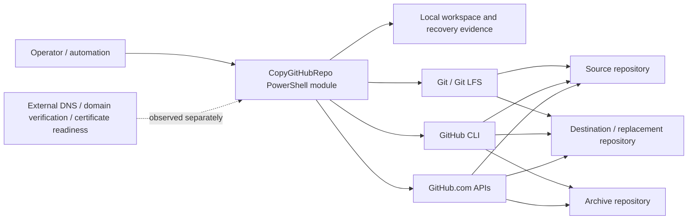
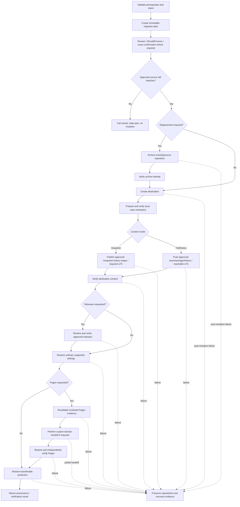
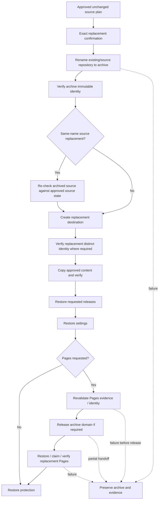

# Architecture

## Goals

Copy GitHub Repository is designed around safe orchestration, explicit authority, immutable reviewed source state, recoverability, and evidence-based verification. Presentation remains separate from copy semantics so console behavior cannot weaken the application safety model.

`Snapshot` is the default clean current-state publication mode. `FullHistory` is the explicit history-preserving copy mode. GitHub Pages restoration is a separate opt-in GitHub-side state capability governed by the [GitHub Pages migration contract](github-pages-migration-contract.md).

Durable architectural rationale is recorded in [`docs/product/adr/`](adr/README.md). The product contracts remain authoritative for behavioral requirements.

## System context and trust boundaries

Trust-boundary interpretation:

- The **operator boundary** supplies intent, confirmation, credentials already managed by GitHub CLI, and report paths.
- The **module/application boundary** owns planning, safety checks, orchestration, verification, and evidence semantics.
- The **local process boundary** contains temporary Git workspaces and durable reports. Local disk/resource failure can interrupt execution but must not redefine remote success.
- The **native-tool boundary** contains Git, Git LFS, and `gh`. Native processes are invoked without shell evaluation through centralized infrastructure helpers.
- The **GitHub.com boundary** is externally mutable and permission/service dependent. Repository names are not treated as immutable identities; repository IDs/node IDs are used where available.
- The **external Pages readiness boundary** contains DNS records, account/organization domain verification, certificate issuance/propagation, and similar state. It can be observed/reported but is not migrated or used as mutable execution authority.
- Secret values remain outside migration state and are never requested/copied.
- The current release line supports only `github.com`; other hosts fail closed.

## Layers

1. **Launcher** imports the module and starts the public wizard.
2. **Presentation** owns interactive prompts, contextual controls, progress, and concise result rendering.
3. **Application** owns planning, approved-plan execution, replacement orchestration, verification, releases/settings/Pages/protection restoration, provenance, and recovery.
4. **Domain/evidence** models plans, immutable source/Pages state, completed steps, repository identity, verification evidence, and results.
5. **Infrastructure** invokes Git, GitHub CLI, and GitHub APIs.

`Start-CopyGitHubRepositoryWizard` is not a second copy engine. `Copy-GitHubRepository -PlanOnly` creates its real review artifact; after review the wizard passes that same plan to the private approved-plan application boundary.

## Logical-to-physical map

| Logical responsibility | Primary physical location | Notes |
| --- | --- | --- |
| Public application entry points | `src/CopyGitHubRepo/Public/` | Public commands and their PowerShell-facing contracts. |
| Planning, copy, verification, and result orchestration | `src/CopyGitHubRepo/Private/Migration/` | Approved-plan execution, Snapshot/FullHistory copy, verification, provenance, and reporting. |
| Replacement and archive safety | `src/CopyGitHubRepo/Private/Replacement/` | Existing-destination and same-name replacement, exact confirmation, identity checks, and recovery reporting. |
| Repository state and protection | `src/CopyGitHubRepo/Private/Repository/` | Repository discovery/modeling, approved source state, preflight, protection, and host support. |
| Pages service integration | `src/CopyGitHubRepo/Private/GitHub/` plus migration/replacement orchestration | Pages planning evidence, drift assertion, activation guard, restoration, read-back verification, and custom-domain handoff support. |
| Presentation/wizard helpers | `src/CopyGitHubRepo/Private/Wizard/` plus public wizard entry | Presentation delegates to shared application semantics, including reviewed Pages evidence. |
| Native Git boundary | `src/CopyGitHubRepo/Private/Git/` | Centralized process invocation, Git identity, and Git LFS helpers. |
| GitHub API/CLI adapters | `src/CopyGitHubRepo/Private/GitHub/` | GitHub reads/mutations, authentication, repository/settings/Pages operations, and existence checks. |
| Shared private utilities | `src/CopyGitHubRepo/Private/Utility/` | Small cross-capability helpers that do not own product workflow. |
| Module composition/exports | `src/CopyGitHubRepo/CopyGitHubRepo.psm1`, `CopyGitHubRepo.psd1` | Deterministic private loading, public exports, and package metadata. |
| Automated executable conformance | `tests/unit/`, `tests/integration/`, `tests/contract/`, `tests/TestTaxonomy.psd1` | Deterministic Unit, Integration, and Contract classifications. |
| Authenticated live conformance | `tests/e2e/` | Disposable-GitHub E2E harnesses; capability is distinct from exact release-candidate evidence. |
| Build/quality/package tooling | `build/` | Stable repository-owned build entry points/configuration and analyzer rules. |
| CI/release/deployment boundaries | `.github/workflows/` | Cross-platform quality, documentation/site, and release automation. |
| Product/quality/architecture authorities | `docs/` | Product contracts/models, quality strategy, architecture, recovery, and ADRs. |

For maintainer change-impact guidance, see [`maintainer-guide.md`](../engineering/maintainer-guide.md).

## Common execution flow

The Snapshot and FullHistory branches share planning, replacement, verification staging, requested-release restoration ordering, ordinary settings, optional Pages restoration, protection-last ordering, provenance, and recovery semantics. Their content and tag-target invariants remain deliberately different.

Copied site files and Pages workflow files are handled only as Git content by the content branch. They are not evidence that the GitHub-side Pages state has been restored. The Pages stage is separate and consumes immutable reviewed Pages evidence.

## Planning boundary

`New-CgrMigrationPlan` validates source/destination/archive intent, captures supported source protection/configuration evidence, and captures `SourceState` before returning the plan.

Snapshot `SourceState` contains approved repository identity when available, default branch, commit SHA, tree SHA, and Git LFS evidence. With `-IncludeReleases`, the plan additionally binds the exact approved release selection and immutable Snapshot release-checkpoint evidence derived from it.

FullHistory `SourceState` contains approved repository identity when available, default branch, sorted branch/tag ref targets, reachable commit count, branch-tip trees, and Git LFS availability.

When `-RestorePages` is requested, the same reviewed plan also captures immutable Pages evidence: configured state, build type, exact branch/path where applicable, custom domain, HTTPS intent, representability, and separately classified external readiness. Execution does not rerun mutable Pages discovery/selection as authority.

Planning performs no GitHub mutation.

## Snapshot release-checkpoint architecture boundary

The normative behavior of `Snapshot -IncludeReleases` is defined only in [`product-contract.md#snapshot-release-checkpoint-contract`](product-contract.md#snapshot-release-checkpoint-contract). Architecture does not duplicate its topology rules.

Architecturally, Snapshot release preservation is a distinct checkpoint-history construction path inside the Snapshot content boundary, not a FullHistory rewrite and not a conventional squash/rebase of the source graph. It consumes reviewed release/tag evidence, validates deterministic ancestry ordering, and fails closed before mutation when selected topology cannot be represented safely.

Plain Snapshot remains the one-unrelated-root path when `-IncludeReleases` is absent. FullHistory remains history-preserving. The Snapshot release path reuses shared approved release-selection/restoration infrastructure where contracts match while keeping checkpoint construction, recreated tag targets, verification/provenance, recovery evidence, and wizard integration mode-aware.

## GitHub Pages architecture boundary

The normative Pages behavior is defined in [`github-pages-migration-contract.md`](github-pages-migration-contract.md). The operator-facing guide is [`github-pages-migration.md`](../user/github-pages-migration.md).

Architecturally, Pages is a **post-content-verification GitHub-side restoration stage**, not part of Git publication. The boundary enforces four separations:

1. **Git content vs service state.** Site/workflow files can exist without proving Pages configuration.
2. **Reviewed evidence vs live rediscovery.** Planning binds Pages evidence; immediate pre-mutation revalidation detects drift, while execution still applies reviewed intent.
3. **GitHub-side state vs external readiness.** DNS/domain verification/certificate state is reported separately and never mutated or claimed as transferred.
4. **Deterministic restoration vs activation side effects.** Copied Pages workflow activation is guarded until the approved Pages restore/verify boundary where the contract requires it.

Actions-based Pages restores the reviewed `workflow` build type. Branch/path Pages restores only the exact reviewed branch and supported path when representable; Snapshot does not invent missing publishing branches or redirect to substitute sources.

For custom-domain replacement, repository identity and exact reviewed ownership bind the handoff. Archive release and replacement claim/read-back are individually evidenced. A partial handoff enters recovery without destructive automatic rollback when ownership is uncertain.

HTTPS intent is restored where deterministic; certificate readiness remains external/asynchronous. `PendingCertificate` can therefore be a valid readiness result after correct GitHub-side configuration rather than a deterministic migration failure.

## Approved-plan execution boundary

`Invoke-CgrApprovedMigrationPlan` is the shared internal execution boundary for the public command and wizard. It requires `SourceState`, re-checks source before first mutation, preserves exact replacement-confirmation rules, and dispatches the already-reviewed plan into appropriate orchestration.

If repository identity or Git state no longer matches, `Assert-CgrApprovedSourceState` fails closed before first GitHub mutation for that plan. New-destination execution stops before destination creation; replacement stops before archive rename.

Pages adds a second, capability-specific stale-state boundary immediately before Pages mutation. This is intentionally later because content/release/settings may already have completed. Pages drift does not silently replace the reviewed intent; it stops Pages mutation and preserves current migrated state for recovery/replanning.

The public command creates one plan, applies validation/`ShouldProcess`/confirmation rules, and executes that same plan. It does not reconstruct a second plan after confirmation.

## Guided interaction boundary

The wizard uses native PowerShell interaction helpers. Valid contextual controls are displayed explicitly: `[? help]`, `[B back]`, `[C cancel]`, and `[F filter]` only for repository filtering. Enter accepts the displayed default.

The wizard displays **Repository copy plan** with mode-specific human language. Plain Snapshot is described as clean publication into one unrelated root commit. Snapshot release preservation explains new checkpoint commits and non-preservation of original commit identities/ancestry. FullHistory is history-preserving.

Pages is an explicit off-by-default decision. The wizard presents actual plan-derived configured state, build mode/source, custom domain, HTTPS intent, representability, and external boundaries where available. Same-name custom-domain handoff is surfaced before execution. The wizard does not invent Pages state or replace deterministic execution checks.

After Execute, the wizard's `ShouldProcess` guard runs and the exact displayed plan is sent to the approved-plan boundary. Plan-driving stale state causes fail-closed replanning/review rather than silent approval of newly observed state.

## Copy-workspace boundary

The pre-mutation source check closes the plan/review TOCTOU window, but source state is also checked inside the cloned workspace before destination publication:

- Snapshot verifies cloned commit/tree and LFS evidence against approved Snapshot state before creating/pushing destination history. With release preservation it also consumes reviewed release/tag/tree evidence already captured by the plan.
- FullHistory verifies bare-clone ref targets, reachable commit count, branch-tip trees, and LFS evidence before pushing LFS objects, branches, or tags.

This prevents a moving source from being substituted between preflight and clone.

## Destination verification boundary

Execution verification does not reclone a potentially moved source and redefine success after publication.

Plain Snapshot destination verification compares destination tree and one-root-commit history shape with approved/copied Snapshot evidence. Snapshot release-checkpoint verification independently proves generated checkpoint sequence/parentage, checkpoint tree/state equivalence, selected release tag targets, and final reviewed HEAD state from immutable checkpoint evidence. Release metadata/assets and Latest designation are verified separately against the same approved selection.

FullHistory destination verification compares destination branch/tag targets, reachable commit count, branch-tip trees, default branch, and LFS availability with approved evidence. FullHistory release verification retains original tag commit-identity semantics.

Pages verification is separately read-only and independent of restoration mutation. It compares supported destination GitHub-side Pages state against reviewed Pages evidence, including configured state, build type, exact branch/path, custom domain, HTTPS where deterministic, and replacement archive/replacement domain ownership. External DNS/domain verification/certificate readiness is reported separately.

`Test-GitHubRepositoryMigration` remains a separate explicit read-only command for its supported content/release verification contract; Pages restoration also performs its dedicated independent GitHub-side read-back verification.

## Replacement flow

Same-name replacement uses the archive's canonical identity/clone URL after rename rather than relying on an old-name redirect. Existing-destination archive-and-replace verifies archived destination identity before creating replacement. Snapshot release preservation keeps selected archive evidence bound to reviewed checkpoint plan; FullHistory retains original tag targets.

For reviewed Pages custom domains, archive identity and exact domain binding must still match approved evidence before release. Replacement must be a distinct authorized repository identity. Successful handoff leaves the archive no longer owning the production domain and the replacement owning the exact reviewed domain. External DNS is not mutated.

## Mutation and recovery state model

The canonical operator-facing mutation/recovery state model is maintained in [`troubleshooting-recovery.md`](../user/troubleshooting-recovery.md#mutation-and-recovery-state-model). Architecture reuses that model instead of maintaining a competing recovery contract.

Architectural interpretation:

- Before first mutation, a rejected/stale operation remains a no-op against GitHub.
- Archive/rename and destination creation are explicit mutation boundaries.
- Verification separates "published" from "verified." Requested releases, settings, Pages, or protection can fail after content is verified.
- A Pages custom-domain handoff has its own ownership-sensitive sub-stages that must be preserved in recovery evidence.
- A post-mutation failure transitions to preservation/recovery, not automatic rollback.

## Configuration restoration

Ordinary supported repository settings are restored only after content verification and are read back for verification. Requested releases are restored/verified after content verification and before settings. Requested Pages restoration follows ordinary settings and precedes protection. Transferable repository protection remains last so it cannot block initial publication, requested release restoration, or approved Pages restoration.

Plans retain captured protection and Pages evidence; execution reuses that reviewed evidence rather than performing unrelated late rediscovery as authority. Security/identity semantics that cannot be transferred safely are reported as skipped/unsupported or fail closed rather than being weakened.

## Provenance and recovery

Structured execution results distinguish `ApprovedSourceState` from actual copied evidence. Snapshot provenance records destination commit/tree and repository identities; release-preservation provenance adds reviewed/generated checkpoint/tag/release evidence. Replacement results expose original/archive/replacement identity explicitly.

Pages results/recovery evidence add reviewed Pages configuration, restoration/read-back state, activation-guard state, external readiness classification, last successful Pages stage, and custom-domain handoff details where applicable. DNS mutation and automatic rollback are explicitly not claimed.

Recovery reports retain failure stage, completed steps, known repository identities, and available planned-versus-copied/restored evidence. Recovery does not automatically delete repositories, commits, tags, releases, or Pages state, rename repositories back, or destructively rebind a domain when ownership is uncertain.

## Runtime and infrastructure

The compatibility baseline is PowerShell 7.4+ on Windows, macOS, and Linux. Git and GitHub CLI are prerequisites. HTTPS Git operations use GitHub CLI as a command-scoped credential helper without changing global Git configuration. FullHistory requires Git LFS; Snapshot requires it when an approved Snapshot state contains LFS-tracked content.

The current release line supports only `github.com`, case-insensitively, and fails closed for unsupported hosts.

## Architecture fitness functions

Architecture claims are protected through executable conformance rather than review prose alone.

| Architectural property | Primary executable evidence |
| --- | --- |
| Plan is bound to immutable approved source state and stale plans fail closed | approved-source/stale-state suites |
| Snapshot retains one-root semantics unless release checkpoints are requested | Snapshot contract/integration/E2E suites |
| Snapshot release preservation constructs/verifies reviewed checkpoints without preserving source commit identity | Snapshot release planning/execution/verification suites and E2E harness |
| FullHistory preserves approved refs/history | FullHistory integration/E2E suites |
| Existing/same-name replacement preserves identity and does not silently overwrite | replacement safety/integration/E2E suites |
| Pages planning is immutable and drift fails closed before Pages mutation | Pages planning/drift contract and integration suites |
| Pages Actions/branch-path restoration, activation control, independent read-back, and custom-domain handoff obey the reviewed contract | Pages unit/integration/contract suites and Pages E2E harness |
| External DNS/certificate/secrets are not treated as migrated Pages state | Pages contract/recovery/E2E safety assertions |
| Partial failure retains recovery evidence instead of auto-rollback | recovery/risk suites plus replacement/Pages recovery assertions |
| Settings follow content/releases; Pages follows settings when requested; protection is last | post-verification orchestration and Pages ordering suites |
| Wizard delegates to shared application semantics and real Pages plan evidence | wizard migration/orchestration/Pages suites |
| Native commands use controlled process invocation | native command stream/analyzer/style contracts |
| Unsupported hosts fail closed | host-name suites |
| Human/machine documentation classification remains aligned | test taxonomy and documentation contract suites |

The detailed quality/evidence semantics are authoritative in [`quality-strategy.md`](../engineering/quality-strategy.md). An E2E harness existing means **E2E-capable**, not that an exact release candidate has been live-validated.

## Architecture decisions

Accepted durable decisions are indexed in [`docs/product/adr/README.md`](adr/README.md). Pages-specific normative decisions are consolidated in the [GitHub Pages migration contract](github-pages-migration-contract.md) to avoid conflicting architecture prose.

## Release boundary

Stable publication is tag-only. The tag must match `v<ModuleVersion>` and the exact tagged commit must pass the reusable Windows, Ubuntu, and macOS quality gate before release publication. The release/installer trust model is documented separately from repository-copy execution semantics.
