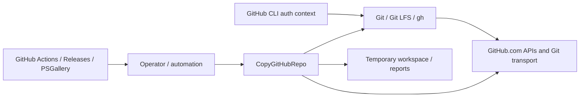

# Security architecture and threat model

This document is the authoritative reviewer-facing security model for Copy GitHub Repository. It consolidates protected assets, trust assumptions, threat classes, controls, evidence, and residual risk without replacing the behavioral contract in [`product-contract.md`](../product/product-contract.md), the architecture in [`architecture.md`](../product/architecture.md), the quality evidence model in [`quality-strategy.md`](../engineering/quality-strategy.md), or the installation trust authority in [`installation-security.md`](installation-security.md).

`SECURITY.md` remains the vulnerability-reporting and supported-security-version front door.

## Security objectives

The project is designed to:

- preserve the operator-approved source state rather than silently substituting newer state;
- prevent accidental overwrite/deletion of existing repositories;
- preserve repository identity and recovery evidence across replacement failures;
- avoid shell-string command execution and unnecessary credential exposure;
- fail closed when required host, identity, state, permission, or verification assumptions are not satisfied;
- make security-relevant evidence and residual risk auditable without overstating unimplemented controls.

## Protected assets

| Asset | Security concern |
| --- | --- |
| Source repository identity and approved content state | substitution, TOCTOU drift, unauthorized mutation |
| Destination/archive repository identity | overwrite, identity confusion, loss of recovery path |
| GitHub CLI authentication material | disclosure, unintended reuse, logging |
| Repository settings/protection state | accidental weakening or incorrect restoration |
| Local temporary workspaces | tampering, stale/malformed content, resource failure |
| Recovery/provenance reports | integrity, accidental sensitive-data disclosure |
| Release ZIP/checksum, SBOM, provenance attestations, and future signing evidence | artifact substitution, publication compromise |
| Development/CI dependencies and workflow definitions | supply-chain compromise |

## Actors and trust assumptions

- **Operator / automation** supplies intent, repository names, confirmation, local report destinations, and access through an already authenticated GitHub CLI context.
- **CopyGitHubRepo module** is trusted to enforce the product contract, safety checks, execution ordering, verification, and evidence semantics.
- **PowerShell runtime** is trusted to load and execute the module and helper scripts.
- **Git, Git LFS, and GitHub CLI** are external native prerequisites whose executables and behavior are outside the module's direct control.
- **GitHub.com** is the supported remote platform for v0.1.0. API and Git transport availability, authorization, repository identity, and platform-side mutation are external trust dependencies.
- **GitHub Actions / release environment** is trusted for CI and release automation subject to repository permissions, workflow integrity, and configured secrets/environments.
- **PowerShell Gallery** and **GitHub Releases** are distribution services, not runtime dependencies of an installed module.

The project does not assume repository names are immutable identities. GitHub repository IDs/node IDs are used where available for identity-sensitive replacement checks.

## Trust boundaries and sensitive-data flow



Credential/data rules:

- The module uses existing GitHub CLI authentication and does not intentionally collect, display, copy, or persist token values.
- HTTPS Git operations use GitHub CLI credentials through command-scoped Git configuration; interactive credential prompting is disabled.
- GitHub secrets, webhook secrets, private deploy-key material, GitHub App credentials, environment secrets, and similar secret-bearing configuration are outside the repository-copy contract.
- Normal results/recovery evidence may contain repository names, immutable repository IDs, commit/tree SHAs, mode, completed stages, failure stage, and verification/provenance evidence.
- Tokens, secret values, private keys, and unrelated private repository content must not be written intentionally to console output, reports, diagnostics, or CI artifacts.
- Diagnostic output is still a security boundary: future logging changes must be reviewed for credential and sensitive-content leakage.

## Privileged and destructive operations

Security-sensitive mutations include:

1. archive/rename of an existing destination or same-name source;
2. destination/replacement repository creation;
3. Git content and LFS publication;
4. repository settings restoration;
5. repository protection restoration;
6. release/package publication by maintainer workflows.

Planning, `-PlanOnly`, and `-WhatIf` remain non-mutating. Before the first GitHub mutation, the application revalidates the immutable approved source state. Exact replacement confirmation and `ShouldProcess` boundaries are part of the authorization model; same-name destructive confirmation is not bypassed by ordinary confirmation suppression.

After a post-mutation failure, the product preserves known repositories and recovery evidence. It does not automatically delete repositories or rename archives back.

## Threat and failure model

| Threat / failure class | Primary security effect | Current mitigation / behavior |
| --- | --- | --- |
| Shell/command injection | arbitrary local command execution | centralized native-process helpers, discrete argument lists, custom security analyzer rules, engineering prohibition on shell-string evaluation / `Invoke-Expression` |
| Stale-state substitution / TOCTOU | operator approves one source state but another is copied | immutable `SourceState`, pre-mutation revalidation, workspace revalidation, fail-closed `SourceStateChangedSincePlanning` |
| Destination overwrite / destructive confusion | loss of existing repository | archive-before-replace, exact confirmation, immutable identity checks, distinct replacement identity |
| Repository-name identity confusion | wrong repository accepted after rename/recreate | immutable GitHub repository identity continuity where available |
| Credential leakage | token compromise | existing GitHub CLI auth context, no intentional token persistence/display, command-scoped credential configuration, analyzer detection for direct emission of secret-bearing variables |
| Malformed or adversarial remote state | unsafe execution or incorrect verification | validation/normalization, explicit supported-host boundary, approved-plan evidence, destination read-back verification |
| Native prerequisite compromise | arbitrary behavior below module boundary | documented prerequisite/trust boundary; centralized invocation and static boundary enforcement reduce but do not eliminate risk |
| Network/API interruption or throttling | incomplete operation / partial mutation | bounded retry for recognized side-effect-free GitHub API reads; mutation calls are not automatically replayed; preservation/recovery semantics apply |
| Local disk/temp resource failure | interrupted copy/evidence loss | observed-workspace preflight can reject a defensible shortage before mutation; later exhaustion follows preservation-first recovery semantics |
| Partial mutation | archive/destination may exist after failure | explicit completed-stage/recovery evidence; no automatic rollback/delete |
| Settings/protection restoration failure | verified content with incomplete configuration | content verifies first, settings then protection; failure is reported as a distinct late mutation state |
| Release artifact substitution | user installs unintended bytes | SHA-256 integrity comparison plus GitHub build-provenance and SBOM attestations bind release evidence to the versioned ZIP; independent publisher signing remains a separate control |
| Dependency/workflow compromise | CI/release or development environment compromise | exact dependency/action pinning, reviewed development dependency versions, dedicated PowerShell security analysis, CodeQL analysis of GitHub Actions workflows, dependency monitoring, and repository-security baseline verification |
| Persistent PSGallery trust mutation during dev setup | workstation trust posture altered | development dependency installer targets PSGallery explicitly without changing repository `InstallationPolicy`; regression is protected by `DevelopmentDependencies.Tests.ps1` |

## Security control and evidence matrix

Status vocabulary:

- **Implemented** — enforced in repository code/configuration.
- **Automatically verified** — protected by tests/analyzers/workflows.
- **Platform-provided / live verification required** — depends on live GitHub/repository configuration and must not be inferred from source alone.
- **Planned / open** — a documented control is not yet implemented or satisfied.
- **Residual risk** — risk that remains after current controls.

| Control | Purpose | Current implementation / authority | Evidence | Status |
| --- | --- | --- | --- | --- |
| Approved immutable source state | TOCTOU/substitution defense | planning + approved-plan execution + workspace checks | `ApprovedSourceState.Tests.ps1`, `StaleStateSafety.Tests.ps1`, architecture fitness functions | Implemented + automatically verified |
| Archive-before-replace and identity continuity | destructive-operation safety | replacement orchestration/product contract | replacement/same-name integration tests and E2E harnesses | Implemented + automatically verified; live evidence remains release-specific |
| Distinct replacement identity | prevents renamed repository from masquerading as replacement | immutable repository ID checks where available | same-name/replacement tests | Implemented + automatically verified |
| No automatic rollback/delete | preservation and forensic/recovery safety | recovery/result contract | recovery/risk-failure tests | Implemented + automatically verified |
| Centralized native process invocation | command-injection/quoting boundary | process helpers using argument lists/no shell evaluation | native-command tests + analyzer contracts | Implemented + automatically verified |
| Credential minimization | reduce token exposure | existing `gh` auth, command-scoped helper, no intentional token persistence/output | security/documentation contracts and implementation review | Implemented; not a guarantee against compromised prerequisites |
| GitHub.com-only host guard | prevents unvalidated host semantics | explicit fail-closed host checks | `HostName.Tests.ps1` | Implemented + automatically verified |
| Content-before-settings/protection ordering | prevents protection from blocking initial publication and makes late failure explicit | application orchestration | settings/protection tests | Implemented + automatically verified |
| Release ZIP SHA-256 check | integrity/corruption detection | stable installer/release contract | installation-security and release contract tests | Implemented contract; does not independently authenticate publisher |
| Development dependency version review | reduce stale development-tool risk | exact pins in `build/DevelopmentDependencies.psd1` | cross-platform project-quality validation and upstream release/advisory review | Implemented + automatically verified for selected pins |
| Dedicated PowerShell code security analysis | expose PowerShell-specific security failures separately from general quality | `.github/workflows/analyze-code-security.yml` using `PSScriptAnalyzerSecuritySettings.psd1`, `Measure-CgrSecurity`, selected built-in rules, and targeted Pester evidence | `CodeSecurityWorkflow.Tests.ps1`, `PSScriptAnalyzerSecurityRules.Tests.ps1`, safety/recovery tests | Implemented + automatically verified when the dedicated workflow passes |
| CodeQL for GitHub Actions | workflow-code static analysis | `.github/workflows/analyze-github-actions-security.yml`, language `actions`, `security-extended` queries | `CodeQLWorkflow.Tests.ps1` + successful live CodeQL workflow execution | Implemented + automatically verified for GitHub Actions workflows; does not scan PowerShell source |
| Automated dependency/supply-chain monitoring | outdated/vulnerable dependency visibility | `.github/dependabot.yml`, `.github/workflows/monitor-dependencies.yml`, [`dependency-monitoring.md`](dependency-monitoring.md) | `DevelopmentDependencies.Tests.ps1` + scheduled/manual workflow contract | Implemented + automatically verified |
| Live GitHub security-setting baseline | secret scanning, push protection, Dependabot/code scanning settings and main-branch ruleset expectations | [`repository-security-baseline.md`](repository-security-baseline.md) | live repository settings and owner-side verification | Platform-provided / live verification required; baseline currently not fully satisfied |
| Independent release authenticity/signing | publisher/artifact authenticity independent of GitHub-hosted attestations/checksums | this security architecture plus release readiness | future signature/authenticity verification | Planned / open; must be explicitly dispositioned for release |
| PSGallery trust-policy preservation | avoid persistent development-host trust mutation | dependency installer does not call `Set-PSRepository`; exact versions are installed from explicit `PSGallery` source | `DevelopmentDependencies.Tests.ps1`, cross-platform project-quality validation | Implemented + automatically verified |
| SBOM / provenance evidence | component/release assurance | `build/New-ReleaseSbom.ps1`, `.github/workflows/publish-release.yml`, [`release-sbom.md`](release-sbom.md) | `ReleaseSbom.Tests.ps1`, release workflow contracts, cross-platform project-quality evidence | Implemented + automatically verified |

## Release SBOM and provenance evidence

Stable release automation generates **SPDX 2.3 JSON** from the completed deterministic release ZIP rather than from an unrelated mutable source tree. `build/New-ReleaseSbom.ps1` records the exact shipped file inventory, SHA-256 file and artifact checksums, package/version identity, source commit, deterministic creation metadata, and the SPDX 2.x package verification code required by that format.

The stable publication workflow publishes the `.spdx.json` sidecar and uses immutable-pinned `actions/attest` steps for build provenance and **SBOM attestation** of the same versioned ZIP. Required attestation failures fail publication before the GitHub Release is created. See [`release-sbom.md`](release-sbom.md) for retrieval, verification, classification, and reproducibility details.

These controls strengthen artifact provenance and machine-readable software inventory, but they do not replace independent publisher signing. GitHub attestations establish statements about artifact digest, workflow/repository identity, and predicates within GitHub's attestation model; they do not independently authenticate a separately managed publisher key, prove vulnerability absence, or make semantic SBOM classification infallible. The current release evidence therefore does not replace independent publisher signing.

## Dependency and trust inventory

| Class | Current dependency / service | Security posture |
| --- | --- | --- |
| Runtime platform | PowerShell 7.4+ | external prerequisite |
| Runtime native prerequisite | Git | external executable/trust boundary |
| Runtime native prerequisite | GitHub CLI | authentication/API prerequisite |
| Conditional runtime prerequisite | Git LFS | required for FullHistory and Snapshot with approved LFS content |
| Runtime PowerShell modules | none declared by the module manifest | no third-party PowerShell runtime dependency currently shipped |
| Development modules | Pester 6.1.0, PSScriptAnalyzer 1.25.0 | exact-version pinned; weekly freshness/advisory monitoring is documented in [`dependency-monitoring.md`](dependency-monitoring.md) |
| CI actions | GitHub Actions referenced by workflows | immutable SHA pinning is repository policy; Dependabot proposes reviewed updates and CodeQL analyzes workflow code |
| Runtime remote service | GitHub.com | v0.1.0 supported host and primary external service |
| Distribution | GitHub Releases, PowerShell Gallery | release/distribution trust boundaries; not installed-module runtime dependencies |

## Security static-analysis policy

PowerShell code security and GitHub Actions security use separate analysis surfaces because CodeQL does not analyze the project's PowerShell source.

### PowerShell code security

`PSScriptAnalyzerSecuritySettings.psd1` is the dedicated security profile. It intentionally selects a small set of high-signal built-in PSScriptAnalyzer rules plus the repository-owned `Measure-CgrSecurity` custom rule. The custom rule targets high-confidence patterns in production and operational PowerShell:

- `Invoke-Expression` / `iex` dynamic evaluation;
- explicit `cmd /c`, `sh -c`, `bash -c`, or `zsh -c` shell interpretation;
- direct `git`, `gh`, or `git-lfs` invocation from module source that bypasses the centralized native-process boundary;
- direct output/diagnostic emission of variables whose names indicate token, password, secret, credential, private-key, API-key, or authentication material.

`.github/workflows/analyze-code-security.yml` runs that profile and targeted Pester evidence for security-sensitive behavior including host restrictions, source-state drift, replacement confirmation, retry/mutation rules, recovery evidence, and analyzer detections. `PSScriptAnalyzerSecurityRules.Tests.ps1` verifies positive detections and safe cases.

This dedicated gate is intentionally not a second copy of the general project-quality workflow. The general `PSScriptAnalyzerSettings.psd1` path continues to apply broader quality/style analysis; the security workflow gives the smaller security policy and security-sensitive behavioral evidence a distinct required-check surface.

The policy intentionally avoids speculative heuristics that would create routine false positives. A clean analyzer result therefore means the defined high-confidence patterns were not found; it does **not** mean arbitrary PowerShell vulnerabilities cannot exist.

Run the broader repository policy locally through the canonical project gate:

```powershell
./build/Test-Project.ps1
```

For focused contract verification of the security analyzer's positive detections and safe cases, run:

```powershell
./build/Test-Project.ps1 -Category Contract
```

### GitHub Actions CodeQL policy

The repository uses `.github/workflows/analyze-github-actions-security.yml` to analyze GitHub Actions workflow code with CodeQL's `actions` language and `security-extended` query suite. The workflow runs when workflow definitions change on `main` or in pull requests targeting `main`, on a weekly schedule, and by manual dispatch. Third-party actions are pinned to immutable commit SHAs, checkout does not persist credentials, and the analysis job declares only the permissions required to read repository/action metadata and upload code-scanning results.

The initial CodeQL workflow execution completed successfully. Repository contract tests verify the trigger scope, immutable pins, least-privilege permissions, language `actions`, query suite, and absence of `pull_request_target`.

This CodeQL control is intentionally scoped to **GitHub Actions workflow code**. It does not analyze the project's PowerShell source. A successful CodeQL run means the configured GitHub Actions analysis completed successfully; it is not proof that all workflow or product vulnerabilities are absent.

## Security verification strategy and limits

Current verification combines:

- Pester Unit/Integration/Contract suites for safety semantics and failure behavior;
- the dedicated PowerShell security workflow and `PSScriptAnalyzerSecuritySettings.psd1`;
- the broader repository-owned PSScriptAnalyzer policy, including the custom `Measure-CgrSecurity` rule;
- CodeQL analysis of GitHub Actions workflow code;
- workflow/package/documentation contract testing;
- controlled E2E harnesses for selected live GitHub behaviors;
- manual/live verification where platform configuration cannot be proved from repository files.

These mechanisms are **not comprehensive SAST**. PowerShell source is not covered by a CodeQL language analysis in this project; GitHub Actions workflow code is covered separately by CodeQL. A passing security gate, project-quality gate, and CodeQL run are strong conformance evidence for the checks that exist; they are not proof that the software is vulnerability-free.

E2E-capable also does not mean a specific release candidate was live-validated. Exact-release-candidate evidence is governed by [`quality-strategy.md`](../engineering/quality-strategy.md) and the release-readiness process.

## Privacy and telemetry posture

The project does not define a telemetry/analytics subsystem. It operates on operator-selected GitHub repositories and local paths using the operator's authenticated GitHub context. It does not intentionally transmit usage analytics to the project maintainer.

Repository content necessarily crosses Git/GitHub transport boundaries as part of the requested copy operation. Local reports/recovery artifacts remain operator-controlled files. Future telemetry, crash reporting, or centralized diagnostics would be a material product/security/privacy change and would require explicit design and documentation rather than being added implicitly.

## Residual risk and open hardening

The following remain explicit for release review:

- the live repository security baseline is currently not fully satisfied until the required `main` ruleset and owner-side settings are verified;
- independent release authenticity/signing remains a planned/open control and requires explicit release disposition if not implemented;
- native prerequisite compromise (PowerShell, Git, Git LFS, GitHub CLI) remains outside the module's direct enforcement boundary;
- GitHub.com availability, authorization, API behavior, and remote-side consistency are external dependencies;
- no static-analysis combination is proof of vulnerability absence;
- exact release-candidate live evidence remains separate from deterministic CI capability.

## Reporting and incident response

Suspected vulnerabilities should follow [`SECURITY.md`](../../SECURITY.md), not public disclosure. Serious post-publication security, credential, supply-chain, artifact, or distribution incidents use [`incident-response.md`](../release/incident-response.md).

Preservation principles apply throughout incident handling: retain exact affected version/commit/artifact identities and relevant non-secret evidence; do not silently overwrite immutable release evidence or destroy repository recovery state.
