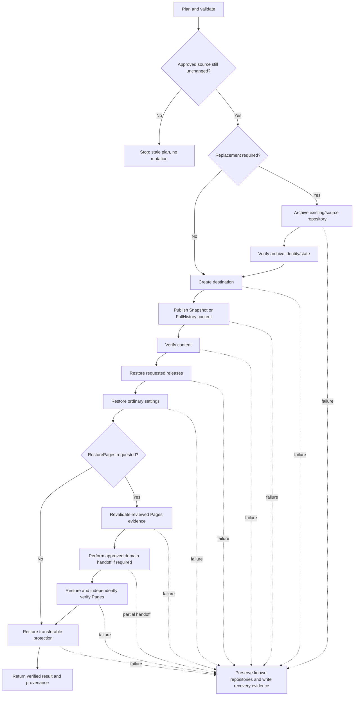

# Troubleshooting and recovery

This guide helps operators determine what a failure means, whether GitHub state may already have changed, what to check safely, and what evidence to preserve before attempting recovery.

For normative behavior and safety invariants, see [`product-contract.md`](../product/product-contract.md). For Pages-specific operating details, see [GitHub Pages migration and recovery](github-pages-migration.md). For the user journey and support matrix, see [`user-guide.md`](user-guide.md).

## First question: could GitHub state already have changed?

Use the stage of failure to decide how cautious recovery must be.

| Failure point | GitHub mutation expected? | Recovery posture |
| --- | --- | --- |
| Prerequisite, authentication, unsupported host, invalid input, destination conflict before approved execution | No | Correct the condition and create/review a new plan as needed. |
| Source state changed before first mutation | No | Treat the reviewed plan as stale; generate and review a new plan. |
| Exact replacement confirmation rejected/cancelled | No | No replacement mutation should have occurred. |
| Existing destination/source was archived or renamed | **Yes** | Preserve the archive and inspect recovery evidence before taking any manual rename/delete action. |
| Replacement destination was created | **Yes** | Both archive and replacement may exist; do not assume rollback. |
| Content publication/push started | **Yes** | Destination may contain partial or complete content; verify before deciding next action. |
| Content verification failed | **Yes** | Destination content exists but must not be treated as verified success. Preserve it and the evidence. |
| Settings restoration failed | **Yes** | Verified content may exist; settings may be partially restored. Do not delete the destination automatically. |
| Pages evidence drift/representability check failed before Pages mutation | Earlier mutation may already exist | Content/releases/settings may already be complete; Pages mutation should not proceed from stale/unsupported evidence. Preserve the destination and replan. |
| Pages creation/configuration/read-back failed | **Yes** | Pages may be partially configured. Preserve recovery evidence and inspect current GitHub-side Pages state before retrying. |
| Custom-domain archive release succeeded but replacement claim/read-back failed | **Yes — ownership-sensitive** | Do not guess or automatically roll back. Determine current archive/replacement domain ownership from recovery evidence and read-back before any mutation. External DNS remains separate. |
| Certificate provisioning/HTTPS readiness is pending | Not necessarily a failure | Distinguish external readiness from deterministic Pages configuration. Do not move/delete resources merely because certificate issuance is still pending. |
| Protection restoration failed | **Yes** | Content/settings/Pages may be valid while protection is incomplete. Treat the repository as requiring security review before normal use. |
| Reporting/recovery-evidence write failed after mutation | **Possibly yes** | Inspect GitHub state directly and preserve console/structured output because durable local evidence may be incomplete. |

The product deliberately favors **preservation over automatic rollback**. It does not automatically delete repositories, rename archives back, or perform destructive custom-domain rollback when current ownership may be uncertain.

## Mutation and recovery state model

The shared model includes optional release and Pages stages:



Key interpretation:

- Before the first mutation, failure should leave GitHub unchanged by the operation.
- After archive/rename or destination creation, failure is a **partial-mutation state**, not a no-op.
- Content verification is a boundary: later release/settings/Pages/protection failures can occur even when copied content is already verified.
- Pages restoration revalidates its own reviewed source evidence immediately before Pages mutation.
- A partial custom-domain handoff is ownership-sensitive recovery state. It is not evidence that automatic rollback restored the previous owner.
- External DNS/domain verification/certificate readiness is observed separately; it is not migrated GitHub-side state.
- Recovery evidence records what is known; it is not an instruction to automatically reverse mutations.

## Symptom-oriented troubleshooting

### The command says GitHub CLI is not authenticated or cannot access the repository

**What it means:** discovery or execution cannot prove access to the requested GitHub.com repository.

**Likely causes:** `gh` is not authenticated for `github.com`, the token/account lacks repository permission, SSO authorization is missing, or the repository name/owner is wrong.

**Safe checks:**

```powershell
gh auth status --hostname github.com
gh repo view owner/repository
```

Do not paste tokens or authentication headers into issue reports.

**Corrective action:** authenticate or re-authenticate the intended GitHub account and confirm that account can read the source and perform required destination operations.

**Could GitHub state already have changed?** Normally no when this occurs during prerequisite/discovery/preflight. If authentication expires after mutation begins, use recovery evidence and inspect repositories before retrying.

### The host is rejected

**What it means:** the current supported release line supports only `github.com`.

**Likely causes:** GitHub Enterprise Server, another Git host, or an incorrectly supplied hostname.

**Safe checks:** review source/destination host values and [`host-support.md`](host-support.md).

**Corrective action:** use `github.com` for the supported release line or do not run the operation.

**Could GitHub state already have changed?** No; unsupported hosts are expected to fail closed before mutation.

### The plan became stale / `SourceStateChangedSincePlanning`

**What it means:** the source no longer matches immutable source evidence that was reviewed.

**Likely causes:** a commit, branch/tag target, repository identity, default branch, or relevant LFS state changed after planning.

**Safe checks:** review source changes and compare them with the plan you approved. Do not try to force the stale plan through.

**Corrective action:** generate a new plan and review newly captured source state.

**Could GitHub state already have changed?** No from that stale execution attempt when detected at the pre-mutation source boundary.

Related scenario: `SCN-PLAN-SAFETY-01`.

### Pages evidence changed before restoration

**What it means:** `-RestorePages` was approved, but mutation-driving Pages state no longer matches the immutable reviewed Pages evidence.

**Likely causes:** configured state, build type, branch/path source, custom domain, HTTPS intent, or another supported Pages property changed after plan review.

**Safe checks:** compare the reviewed Pages evidence with current source Pages state. Do not substitute the newer live configuration into the old execution.

**Corrective action:** stop Pages restoration from that plan and generate/review a new plan. If earlier migration stages already completed, preserve the destination while replanning.

**Could GitHub state already have changed?** **Yes, possibly.** Pages revalidation occurs after destination content verification and ordinary restoration stages, so the repository can already contain verified migrated state even though Pages mutation was stopped.

### A branch/path Pages source is unsupported or unrepresentable

**What it means:** the exact reviewed publishing branch/path cannot safely exist at the destination under the selected content mode.

**Likely causes:** Snapshot would omit the publishing branch, the reviewed path is unsupported, or the destination ref does not match reviewed evidence.

**Safe checks:** review the exact branch/path and selected Snapshot/FullHistory plan. Do not redirect Pages to a different branch merely to continue.

**Corrective action:** choose a content mode/destination plan that can represent the exact source, or intentionally omit Pages restoration. Review a new plan before mutation.

**Could GitHub state already have changed?** Planning can detect this before mutation; execution also fails closed at relevant checks. If detected late, preserve any already-created destination.

### The destination already exists

**What it means:** the selected destination name is occupied and the normal new-destination flow will not overwrite it.

**Likely causes:** an existing repository already uses the name, or an earlier partial attempt created the replacement.

**Safe checks:** inspect the repository in GitHub and record immutable repository identity when available. Check whether a related archive already exists from an earlier attempt.

**Corrective action:** choose a different unused destination, or deliberately select the supported archive-and-replace flow after confirming which repository must be preserved.

**Could GitHub state already have changed?** If this is the initial conflict, no. If the repository may be from an earlier partial attempt, assume yes until identities/recovery evidence prove otherwise.

Related scenarios: `SCN-DEST-SAFETY-01`, `SCN-DEST-PARTIAL-01`.

### The archive name is already in use

**What it means:** the preservation target cannot be used safely because that repository name already exists.

**Likely causes:** an earlier migration attempt, a manually created repository, or a naming collision.

**Safe checks:** inspect the existing archive-name repository and its identity. Never assume it is disposable based on name alone.

**Corrective action:** choose a new unused archive name. If this follows an earlier failed migration, use recovery evidence to determine whether the existing archive is the preserved original.

**Could GitHub state already have changed?** Initial planning conflict: no. Recovery from a prior attempt: possibly yes.

### Exact replacement confirmation is rejected

**What it means:** the replacement acknowledgement did not exactly match required confirmation text.

**Likely causes:** typo, case mismatch, wrong source/destination/archive names, or cancellation.

**Safe checks:** reread displayed identities. Verify you actually intend to archive and replace those exact repositories.

**Corrective action:** regenerate/review the plan if any identity is wrong; otherwise enter exact required confirmation only when satisfied.

**Could GitHub state already have changed?** No from rejected confirmation. `-Force` and `-Confirm:$false` do not bypass this boundary.

Related scenario: `SCN-SAME-SAFETY-01`.

### Git or Git LFS fails before publication

**What it means:** the local source workspace or required LFS evidence could not be prepared/validated for the approved plan.

**Likely causes:** Git/Git LFS missing, credentials unavailable, source network failure, insufficient local disk space, or required LFS objects unavailable.

**Safe checks:**

```powershell
git --version
git lfs version
gh auth status --hostname github.com
```

**Corrective action:** fix the prerequisite/network/content issue, then create/review a new plan if source may have changed.

**Could GitHub state already have changed?** If failure occurred before destination/archive mutation, no. If it occurred while publishing to an already-created replacement, yes.

### Content publication or push fails

**What it means:** mutation started but destination could not be fully populated.

**Safe checks:** inspect archive/replacement existence and identities, destination content, and recorded failure stage/completed steps. Avoid manual pushes until you know which approved source state was in use.

**Corrective action:** preserve all repositories and evidence. Resolve underlying failure first, then use a fresh reviewed plan for any new automated mutation.

**Could GitHub state already have changed?** **Yes.** Destination and archive resources may already exist, and content may be partial.

### Content verification fails

**What it means:** publication happened, but destination could not be proven to match approved Snapshot or FullHistory evidence.

**Safe checks:** preserve destination, plan/provenance/recovery output, and exact verification differences. `Test-GitHubRepositoryMigration` can provide a fresh read-only comparison but does not replace execution-integrated verification against approved plan evidence.

**Corrective action:** do not report/use the copy as verified success. Diagnose mismatch before manual mutation.

**Could GitHub state already have changed?** **Yes.** Destination contains published state even though verification failed.

Related scenarios: `SCN-SNAP-VERIFY-01`, `SCN-HIST-VERIFY-01`.

### Ordinary settings restoration fails

**What it means:** content verification succeeded, but one or more supported repository settings could not be restored/read back successfully.

**Safe checks:** confirm content-verification status first, then compare current destination settings with captured/restoration evidence.

**Corrective action:** preserve destination and recovery evidence. Correct settings deliberately only after confirming content is the intended verified copy.

**Could GitHub state already have changed?** **Yes.** Content exists and some settings may already have been restored.

Related scenario: `SCN-SET-PARTIAL-01`.

### Pages already exists unexpectedly at the restoration stage

**What it means:** destination Pages state exists where the reviewed restoration contract expected no unreviewed Pages configuration.

**Safe checks:** preserve current destination Pages read-back and activation-guard state. Determine whether Pages was created by an external actor or another process. Do not overwrite it automatically.

**Corrective action:** resolve why unexpected Pages state exists, then generate/review a new plan if another migration attempt is appropriate.

**Could GitHub state already have changed?** **Yes.** Repository content and earlier stages may already be complete; unexpected Pages state itself is also GitHub-side state that must be preserved for diagnosis.

### Custom-domain handoff fails after archive release

**What it means:** the reviewed production custom-domain binding may have been released from the archive, while replacement claim or verification did not complete.

**Safe checks:** use recovery evidence to identify `ArchiveReleaseAttempted/Succeeded`, `ReplacementClaimAttempted/Succeeded`, and replacement read-back state. Independently inspect which repository currently reports the custom domain. Verify archive/replacement immutable identities. Treat external DNS as a separate observation only.

**Corrective action:** do not automatically rebind the domain to either repository until current GitHub-side ownership and reviewed intended recipient are proven. Preserve both repositories. If source/ownership state changed, make a new reviewed plan before further automated mutation.

**Could GitHub state already have changed?** **Yes.** This is explicitly a partial ownership handoff state.

### HTTPS/certificate readiness is pending

**What it means:** GitHub-side Pages configuration and custom domain can be restored while certificate issuance/propagation is still asynchronous.

**Safe checks:** confirm deterministic Pages read-back first, then inspect reported external readiness. Do not interpret pending certificate provisioning as proof that DNS or the reviewed Pages configuration is wrong.

**Corrective action:** allow external provisioning/readiness to complete or resolve external prerequisites separately. Do not trigger destructive repository/domain recovery based only on pending certificate state.

**Could GitHub state already have changed?** Yes, because Pages may be successfully restored. Pending certificate readiness is not itself a rollback signal.

### Protection restoration is skipped or fails

**What it means:** transferable protection either could not be safely reproduced or restoration/readback failed.

**Safe checks:** review protection result and [`protection-restoration.md`](protection-restoration.md). Distinguish **skipped/unsupported by design** from **failed restoration**.

**Corrective action:** for skipped non-transferable controls, re-establish appropriate policy manually through the owning organization/security process. For failed transferable restoration, treat destination as not ready for normal use until protection is reviewed.

**Could GitHub state already have changed?** **Yes.** Content, releases, settings, and requested Pages can already be complete; protection is the final restoration stage.

### The wizard cancels or returns to planning

**What it means:** cancellation before mutation is a structured no-change outcome; a stale plan returns the wizard to plan generation/review.

**Safe checks:** read final wizard status and verify whether execution had begun.

**Corrective action:** if no mutation began, simply restart/replan when ready. If wizard reports a post-mutation failure, follow recovery evidence instead of assuming cancellation rolled anything back.

**Could GitHub state already have changed?** Normal pre-execution cancellation: no. Post-mutation failure: yes.

Related scenario: `SCN-WIZ-NOOP-01`.

### Report or recovery-evidence output cannot be written

**What it means:** operation may have completed or failed at a GitHub mutation stage, but requested durable local report could not be saved.

**Safe checks:** preserve console output and any structured object still available. Inspect GitHub repositories directly. Do not infer mutation state from missing file alone.

**Corrective action:** record known identities/stages manually, correct local output-path problem, and avoid further mutation until actual GitHub state is understood.

**Could GitHub state already have changed?** **Possibly yes.** Reporting is not itself the mutation boundary.

## Recovery after an archive/replacement partial failure

When an archive exists and a later stage failed:

1. **Do not delete anything.** Preserve original/archive/replacement repositories exactly as found.
2. **Record identities.** Capture repository names and immutable IDs/node IDs when available.
3. **Read recovery evidence.** Identify failure stage and completed steps.
4. **Determine content state.** Establish whether a replacement exists and whether publication/verification completed.
5. **Determine GitHub-side configuration state.** If content verified, establish ordinary settings, requested Pages, and protection state.
6. **If Pages/custom domain participated, establish ownership before mutation.** Record archive/replacement Pages read-back, exact custom-domain binding, activation-guard state, and whether release/claim/read-back steps succeeded. Do not infer ownership from DNS alone.
7. **Separate external readiness.** DNS records, domain verification, certificate issuance/propagation, and HTTPS readiness may need independent operator action but were not migrated by CopyGitHubRepo.
8. **Choose a deliberate recovery goal.** Examples: retain archive and repair/verify replacement, perform a fresh replacement with a new reviewed plan, or manually restore naming/domain binding only after identities and preservation requirements are understood.
9. **Replan before new automated mutation.** Do not reuse stale approved source/Pages evidence after source/archive state has changed.

The tool does not automatically rename an archive back or automatically reclaim a custom domain because doing so after partial replacement can overwrite useful evidence, collide with a new replacement, or make uncertain ownership worse.

## Evidence to preserve

When troubleshooting a post-mutation failure, preserve as much of the following as is available:

- source, destination, archive, and replacement repository names;
- immutable repository IDs/node IDs when reported;
- selected content mode and relevant options, including whether `-RestorePages` was requested;
- approved source commit/tree or FullHistory ref evidence;
- selected release/checkpoint evidence where applicable;
- reviewed Pages configured state, build type, branch/path source, custom domain, HTTPS intent, and representability;
- actual copied source and destination verification evidence;
- Pages activation-guard state and last successful Pages stage;
- custom-domain handoff evidence: archive release, replacement claim, replacement read-back, and repository identities;
- separately reported external readiness for DNS/domain verification/certificates without treating it as migrated state;
- failure stage and completed steps;
- verification/settings/Pages/protection statuses;
- recovery/provenance report paths and contents;
- exact command/module version and operating system;
- Git, Git LFS, PowerShell, and GitHub CLI versions when relevant; and
- error/friendly failure message and safe diagnostic output.

## Reporting a defect safely

Provide enough information to reproduce/diagnose behavior without exposing sensitive data.

Include CopyGitHubRepo version/commit, PowerShell/OS, selected mode/scenario, whether failure was before/after mutation, sanitized repository identities, failure stage/completed steps, and sanitized structured/recovery evidence.

Do **not** include GitHub tokens, API keys, cookies, authorization headers, credential-helper output, secret values, private repository source files unless necessary/safe, or unrelated personal/access-control data. Pages migration never requires secret values to be copied into a defect report.

Before attaching JSON/Markdown reports publicly, inspect them for private repository names, IDs, URLs, commit metadata, custom-domain information, or other organization-specific information.

## Related behavioral scenarios

This guide consumes the shared scenario taxonomy rather than creating a competing failure model. Particularly relevant scenarios include:

- `SCN-PLAN-SAFETY-01` — stale plan fails before mutation;
- `SCN-DEST-SAFETY-01` — replacement confirmation safety;
- `SCN-DEST-PARTIAL-01` — archive succeeds but later replacement fails;
- `SCN-SAME-SAFETY-01` — same-name identity safety;
- `SCN-SNAP-VERIFY-01` / `SCN-HIST-VERIFY-01` — content verification failures;
- `SCN-SET-PARTIAL-01` — settings failure after verified content;
- `SCN-WIZ-NOOP-01` — normal wizard no-op/cancellation behavior; and
- `SCN-RECOVER-RECOVERY-01` — durable recovery evidence/preservation behavior.

## Related documentation

- GitHub Pages operation and recovery: [`github-pages-migration.md`](github-pages-migration.md)
- User journey and supported-state matrix: [`user-guide.md`](user-guide.md)
- Normative product safety/recovery behavior: [`product-contract.md`](../product/product-contract.md)
- Normative Pages behavior: [`github-pages-migration-contract.md`](../product/github-pages-migration-contract.md)
- Product behavior scenario taxonomy: [`product-model.md`](../product/product-model.md)
- Architecture boundaries/recovery: [`architecture.md`](../product/architecture.md)
- Protection portability: [`protection-restoration.md`](protection-restoration.md)
- Command syntax/output/failures: [`commands/`](../reference/commands/README.md)
- Security reporting: [`../../SECURITY.md`](../../SECURITY.md)