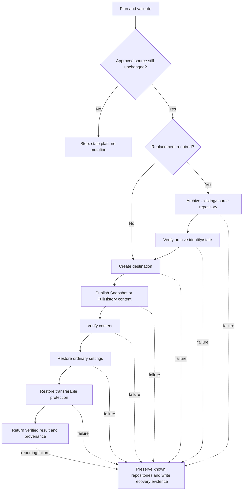

# Troubleshooting and recovery

This guide helps operators determine what a failure means, whether GitHub state may already have changed, what to check safely, and what evidence to preserve before attempting recovery.

For normative behavior and safety invariants, see [`product-contract.md`](../product/product-contract.md). For the user journey and support matrix, see [`user-guide.md`](user-guide.md). Stable behavioral scenario IDs are defined in [`product-model.md`](../product/product-model.md).

## First question: could GitHub state already have changed?

Use the stage of failure to decide how cautious recovery must be.

| Failure point | GitHub mutation expected? | Recovery posture |
| --- | --- | --- |
| Prerequisite, authentication, unsupported host, invalid input, destination conflict before approved execution | No | Correct the condition and create/review a new plan as needed. |
| Source state changed before first mutation | No | Treat the reviewed plan as stale; generate and review a new plan. |
| Exact replacement confirmation rejected/cancelled | No | No replacement mutation should have occurred. |
| Existing destination/source was archived or renamed | **Yes** | Preserve the archive and inspect recovery evidence before taking any manual rename/delete action. |
| Replacement destination was created | **Yes** | Both archive and replacement may exist; do not assume rollback. |
| Content publication/push started | **Yes** | Destination may contain partial or complete content; verify before deciding next action. |
| Content verification failed | **Yes** | Destination content exists but must not be treated as verified success. Preserve it and the evidence. |
| Settings restoration failed | **Yes** | Verified content may exist; settings may be partially restored. Do not delete the destination automatically. |
| Protection restoration failed | **Yes** | Content/settings may be valid while protection is incomplete. Treat the repository as requiring security review before normal use. |
| Reporting/recovery-evidence write failed after mutation | **Possibly yes** | Inspect GitHub state directly and preserve console/structured output because durable local evidence may be incomplete. |

The product deliberately favors **preservation over automatic rollback**. It does not automatically delete repositories or rename archives back after post-mutation failures.

## Mutation and recovery state model

The following shared state model is intended for reuse by user, quality, architecture, security, and assurance documentation.



Key interpretation:

- Before the first mutation, failure should leave GitHub unchanged by the operation.
- After archive/rename or destination creation, failure is a **partial-mutation state**, not a no-op.
- Content verification is a boundary: later settings/protection failures can occur even when copied content is already verified.
- Recovery evidence records what is known; it is not an instruction to automatically reverse mutations.

## Symptom-oriented troubleshooting

### The command says GitHub CLI is not authenticated or cannot access the repository

**What it means:** discovery or execution cannot prove access to the requested GitHub.com repository.

**Likely causes:** `gh` is not authenticated for `github.com`, the token/account lacks repository permission, SSO authorization is missing, or the repository name/owner is wrong.

**Safe checks:**

```powershell
gh auth status --hostname github.com
gh repo view owner/repository
```

Do not paste tokens or authentication headers into issue reports.

**Corrective action:** authenticate or re-authenticate the intended GitHub account and confirm that account can read the source and perform the required destination operations.

**Could GitHub state already have changed?** Normally no when this occurs during prerequisite/discovery/preflight. If authentication expires after mutation begins, use the recovery evidence and inspect the repositories before retrying.

### The host is rejected

**What it means:** v0.1.0 supports only `github.com`.

**Likely causes:** GitHub Enterprise Server, another Git host, or an incorrectly supplied hostname.

**Safe checks:** review the source/destination host values and [`host-support.md`](host-support.md).

**Corrective action:** use `github.com` for v0.1.0 or do not run the operation.

**Could GitHub state already have changed?** No; unsupported hosts are expected to fail closed before mutation.

### The plan became stale / `SourceStateChangedSincePlanning`

**What it means:** the source no longer matches the immutable source evidence that was reviewed.

**Likely causes:** a commit, branch/tag target, repository identity, default branch, or relevant LFS state changed after planning.

**Safe checks:** review the source changes and compare them with the plan you approved. Do not try to force the stale plan through.

**Corrective action:** generate a new plan and review the newly captured source state.

**Could GitHub state already have changed?** No from that stale execution attempt; the pre-mutation source check is specifically intended to stop destination creation/rename.

Related scenario: `SCN-PLAN-SAFETY-01`.

### The destination already exists

**What it means:** the selected destination name is occupied and the normal new-destination flow will not overwrite it.

**Likely causes:** an existing repository already uses the name, or an earlier partial attempt created the replacement.

**Safe checks:** inspect the repository in GitHub and record its immutable repository identity when available. Check whether a related archive already exists from an earlier attempt.

**Corrective action:** choose a different unused destination, or deliberately select the supported archive-and-replace flow after confirming which repository must be preserved.

**Could GitHub state already have changed?** If this is the initial conflict, no. If the repository may be from an earlier partial attempt, assume yes until identities/recovery evidence prove otherwise.

### The archive name is already in use

**What it means:** the preservation target cannot be used safely because that repository name already exists.

**Likely causes:** an earlier migration attempt, a manually created repository, or a naming collision.

**Safe checks:** inspect the existing archive-name repository and its identity. Never assume it is disposable based on name alone.

**Corrective action:** choose a new unused archive name. If this follows an earlier failed migration, use the recovery evidence to determine whether the existing archive is the preserved original.

**Could GitHub state already have changed?** Initial planning conflict: no. Recovery from a prior attempt: possibly yes.

### Exact replacement confirmation is rejected

**What it means:** the destructive/high-risk replacement acknowledgement did not exactly match the required confirmation text.

**Likely causes:** typo, case mismatch, wrong source/destination/archive names, or cancellation.

**Safe checks:** reread the displayed identities. Verify that you actually intend to archive and replace those exact repositories.

**Corrective action:** regenerate/review the plan if any identity is wrong; otherwise enter the exact required confirmation only when satisfied.

**Could GitHub state already have changed?** No from the rejected confirmation. `-Force` and `-Confirm:$false` do not bypass this boundary.

Related scenarios: `SCN-DEST-SAFETY-01`, `SCN-SAME-SAFETY-01`.

### Git or Git LFS fails before publication

**What it means:** the local source workspace or required LFS evidence could not be prepared/validated for the approved plan.

**Likely causes:** Git/Git LFS missing, credentials unavailable to the command-scoped operation, source network failure, insufficient local disk space, or required LFS objects unavailable.

**Safe checks:** confirm installed versions, authentication, free disk space, source reachability, and whether LFS is required by the selected mode/content.

```powershell
git --version
git lfs version
gh auth status --hostname github.com
```

**Corrective action:** fix the prerequisite/network/content issue, then create/review a new plan if the source may have changed.

**Could GitHub state already have changed?** If failure occurred before destination/archive mutation, no. If it occurred while publishing to an already-created replacement, yes; preserve that destination and inspect recovery evidence.

### Content publication or push fails

**What it means:** mutation started but the destination could not be fully populated.

**Likely causes:** network interruption, Git/Git LFS push failure, permission/rate-limit/service failure, repository state conflict, or local resource failure.

**Safe checks:** inspect archive/replacement existence and identities, destination default branch/content, and the recorded failure stage/completed steps. Avoid pushing manually until you know which approved source state the operation was using.

**Corrective action:** preserve all repositories and evidence. Resolve the underlying failure first. Then determine whether the safest next action is to verify/continue through a fresh planned operation, choose a new replacement name, or perform a deliberate manual recovery.

**Could GitHub state already have changed?** **Yes.** Destination and archive resources may already exist, and content may be partial.

Related scenarios: `SCN-DEST-PARTIAL-01` and other `PARTIAL` scenarios in the product model.

### Content verification fails

**What it means:** publication happened, but the destination could not be proven to match the approved Snapshot or FullHistory evidence.

**Likely causes:** incomplete push/LFS transfer, unexpected destination state, branch/tag/tree mismatch, or one-root-commit Snapshot invariant failure.

**Safe checks:** preserve the destination, plan/provenance/recovery output, and exact verification differences. Use `Test-GitHubRepositoryMigration` only when a fresh current-state comparison is useful; remember that it is not identical to execution-integrated verification against the approved plan evidence.

**Corrective action:** do not report/use the copy as verified success. Diagnose the mismatch before any manual mutation. If rerunning, use a newly reviewed plan and an intentionally selected destination/replacement strategy.

**Could GitHub state already have changed?** **Yes.** The destination contains published state even though verification failed.

Related scenarios: `SCN-SNAP-VERIFY-01`, `SCN-HIST-VERIFY-01`.

### Ordinary settings restoration fails

**What it means:** content verification succeeded, but one or more supported repository settings could not be restored/read back successfully.

**Likely causes:** permission/API/service failure, repository capability mismatch, or changed GitHub behavior.

**Safe checks:** confirm content-verification status first, then compare current destination settings with the captured/restoration evidence.

**Corrective action:** preserve the destination and recovery evidence. Correct settings deliberately only after confirming the content is the intended verified copy.

**Could GitHub state already have changed?** **Yes.** Content is expected to exist and some settings may already have been restored.

Related scenario: `SCN-SET-PARTIAL-01`.

### Protection restoration is skipped or fails

**What it means:** transferable protection either could not be safely reproduced or a restoration/readback operation failed.

**Likely causes:** policy is identity-bound/inherited/non-transferable, missing permission, GitHub API/service failure, or a protection rule that cannot be recreated without weakening semantics.

**Safe checks:** review the protection restoration result and [`protection-restoration.md`](protection-restoration.md). Distinguish **skipped/unsupported by design** from **failed restoration**.

**Corrective action:** for skipped non-transferable controls, re-establish appropriate policy manually through the owning organization/security process. For failed transferable restoration, treat the destination as not ready for normal use until protection is reviewed.

**Could GitHub state already have changed?** **Yes.** Content and ordinary settings may already be complete; protection is the final restoration stage.

### The wizard cancels or returns to planning

**What it means:** cancellation before mutation is a structured no-change outcome; a stale plan returns the wizard to plan generation/review.

**Likely causes:** user selected Cancel/Back, rejected execution, `ShouldProcess` stopped execution, or source state changed after review.

**Safe checks:** read the final wizard status and verify whether it says execution had begun.

**Corrective action:** if no mutation began, simply restart/replan when ready. If the wizard reports a post-mutation failure, follow the recovery evidence instead of assuming cancellation rolled anything back.

**Could GitHub state already have changed?** Normal pre-execution cancellation: no. Post-mutation failure: yes.

Related scenario: `SCN-WIZ-NOOP-01`.

### Report or recovery-evidence output cannot be written

**What it means:** the operation may have completed or failed at a GitHub mutation stage, but the requested durable local report could not be saved.

**Likely causes:** invalid/unwritable path, disk/full filesystem, permission failure, or I/O error.

**Safe checks:** preserve console output and any structured object still available in the session. Inspect GitHub repositories directly. Do not infer mutation state from the missing file alone.

**Corrective action:** record the known identities/stages manually, correct the local output-path problem, and avoid further mutation until the actual GitHub state is understood.

**Could GitHub state already have changed?** **Possibly yes.** Reporting is not itself the mutation boundary.

## Recovery after an archive/replacement partial failure

When an archive exists and a later stage failed:

1. **Do not delete anything.** Preserve original/archive/replacement repositories exactly as found.
2. **Record identities.** Capture repository names and immutable IDs/node IDs when available.
3. **Read recovery evidence.** Identify the failure stage and completed steps.
4. **Determine content state.** Establish whether a replacement exists and whether publication/verification completed.
5. **Determine configuration state.** If content verified, establish whether ordinary settings and protection restoration completed.
6. **Choose a deliberate recovery goal.** Examples: retain the archive and repair/verify the replacement, perform a fresh replacement with a new reviewed plan, or manually restore naming only after identities and preservation requirements are understood.
7. **Replan before new automated mutation.** Do not reuse stale approved source evidence after source/archive state has changed.

The tool does not automatically rename an archive back because doing so after partial replacement can overwrite useful evidence, collide with a newly created replacement, or hide which stages actually completed.

## Evidence to preserve

When troubleshooting a post-mutation failure, preserve as much of the following as is available:

- source, destination, archive, and replacement repository names;
- immutable repository IDs/node IDs when reported;
- selected content mode and relevant options;
- approved source commit/tree or FullHistory ref evidence;
- actual copied source evidence when available;
- destination commit/tree/ref verification evidence;
- failure stage and completed steps;
- verification/settings/protection statuses;
- recovery/provenance report paths and contents;
- exact command/module version and operating system;
- Git, Git LFS, PowerShell, and GitHub CLI versions when relevant;
- the error/friendly failure message and any safe diagnostic output.

## Reporting a defect safely

Provide enough information to reproduce/diagnose the behavior without exposing sensitive data.

Include:

- CopyGitHubRepo version/commit if known;
- PowerShell and OS;
- selected mode and scenario (for example `UC-SAME-REPLACE`);
- whether the failure was before or after mutation;
- relevant `SCN-*` identifier if known;
- sanitized repository names if the real names are private;
- failure stage/completed steps;
- sanitized structured/recovery evidence;
- minimal reproduction steps.

Do **not** include:

- GitHub tokens, API keys, cookies, authorization headers, or credential-helper output;
- secret values;
- private repository source files unless specifically necessary and safe to disclose;
- personal/access-control data that is unrelated to the defect.

Before attaching JSON/Markdown reports publicly, inspect them for private repository names, IDs, URLs, commit metadata, or other organization-specific information.

## Related behavioral scenarios

This guide consumes the shared scenario taxonomy rather than creating a competing failure model. Particularly relevant scenarios include:

- `SCN-PLAN-SAFETY-01` — stale plan fails before mutation;
- `SCN-DEST-SAFETY-01` — replacement confirmation safety;
- `SCN-DEST-PARTIAL-01` — archive succeeds but later replacement fails;
- `SCN-SAME-SAFETY-01` — same-name identity safety;
- `SCN-SNAP-VERIFY-01` / `SCN-HIST-VERIFY-01` — content verification failures;
- `SCN-SET-PARTIAL-01` — settings failure after verified content;
- `SCN-WIZ-NOOP-01` — normal wizard no-op/cancellation behavior;
- `SCN-RECOVER-RECOVERY-01` — durable recovery evidence/preservation behavior.

## Related documentation

- User journey and supported-state matrix: [`user-guide.md`](user-guide.md)
- Normative product safety/recovery behavior: [`product-contract.md`](../product/product-contract.md)
- Product behavior scenario taxonomy: [`product-model.md`](../product/product-model.md)
- Architecture boundaries/recovery: [`architecture.md`](../product/architecture.md)
- Protection portability: [`protection-restoration.md`](protection-restoration.md)
- Command syntax/output/failures: [`commands/`](../reference/commands/README.md)
- Security reporting: [`../../SECURITY.md`](../../SECURITY.md)